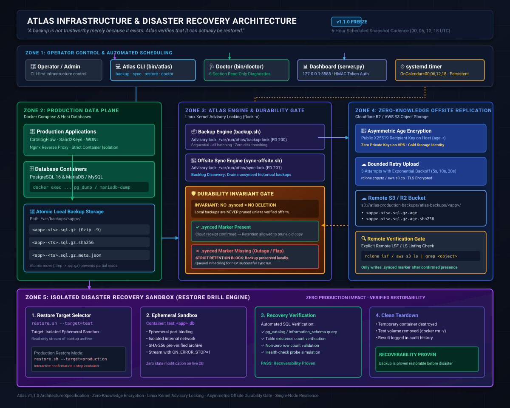

# Atlas Infrastructure & Disaster Recovery Framework (v1.1.0)

Atlas is a resilient, application-agnostic infrastructure, disaster recovery, and operational framework for Linux Virtual Private Servers (VPS). Built with boring, auditable technology—Bash, Docker Compose, Nginx, and Python—Atlas provides hardened deployment pipelines, automated snapshotting, asymmetric zero-knowledge offsite replication, and automated recovery verification without introducing heavyweight cluster orchestrators.

---

## The Core Engineering Thesis

> **A backup is not trustworthy merely because it exists. Atlas verifies that it can actually be restored.**
>
> **The Durability Invariant:** No local backup is deleted by retention unless Atlas has established that a corresponding, recoverable off-site copy exists in cloud storage.

---

## 1. Problem & Failure Modes

Traditional single-host backup scripts suffer from silent, catastrophic failure modes:

1. **Premature Retention Deletion**: When offsite replication fails (cloud outage, expired credentials, network partition), standard retention scripts blindly prune older local backups on a schedule. Over time, all local copies are deleted, while remote storage holds zero valid copies.
2. **Untested Restorability**: Backups that complete with exit code 0 often fail during real disasters due to corrupted SQL streams, missing table schemas, or version incompatibilities.
3. **Secret Key Exposure**: Placing private decryption keys on production VPS hosts exposes backups to complete compromise if the host is breached.
4. **Silent Scheduler Failure**: Host reboots and transient downtimes cause cron to permanently skip scheduled runs, silently degrading Recovery Point Objectives (RPO) from 6 hours to days.
5. **Command Injection in Management APIs**: Unauthenticated dashboard endpoints executing shell commands with user inputs expose VPS hosts to remote root compromise.

---

## 2. Safety Invariants & Engineering Guarantees

Atlas enforces five non-negotiable safety invariants:

* **Strict Durability Gate (`.synced` Authorization)**: Local retention pruning is blocked for any backup archive that lacks an atomic `.synced` marker. The `.synced` marker is written **only after** an explicit remote object existence check (`rclone lsf` or `aws s3 ls`) succeeds.
* **Asymmetric Zero-Knowledge Encryption**: All off-site archives are encrypted on the host using `age` (X25519 public recipient keys). The private identity key is **never** stored on the VPS.
* **Isolated Restoration Proof**: Restoration tests (`restore.sh --app <app> --target=test`) execute against isolated ephemeral Docker containers (`test_<app>_db`) in read-only mode, proving SQL stream integrity without touching production databases.
* **Kernel Advisory Concurrency Locking**: Script executions use non-blocking Linux kernel advisory locks (`flock -n`). Process crashes or abnormal terminations immediately release locks via the kernel; stale lock files cannot exist.
* **Zero Shell Interpretation in Management APIs**: The dashboard server (`dashboard/server.py`) operates with structured argument arrays (`shell=False`), token authentication (`hmac.compare_digest`), strict regex allowlists, and localhost (`127.0.0.1`) binding.

---

## 3. Architecture & Data Flow



```text
       systemd.timer
    (00, 06, 12, 18 UTC)
             │
             ▼
      scripts/backup.sh
             │
             ├──> Database dump (pg_dump / mariadb-dump -> .tmp)
             ├──> Gzip compression (-9 -> .sql.gz)
             ├──> Checksum computation (SHA-256)
             └──> Metadata manifest generation (.meta.json)
             │
             ▼
       LOCAL BACKUP ─────────────────────────┐
             │                               │
             │                               │ [Retention Gate]
             ▼                               │ Strictly preserves un-synced archives;
   scripts/sync-offsite.sh                   │ local copies are ONLY pruned when
             │                               │ .synced authorization marker exists
             ├──> Age asymmetric encryption (.age)
             ├──> Bounded retry (3 attempts: 5s, 10s, 20s backoff)
             ├──> Remote cloud upload (Cloudflare R2 / AWS S3)
             └──> Remote verification gate (rclone lsf / aws s3 ls)
             │                               │
             ▼                               │
   .synced DURABILITY AUTHORIZATION ─────────┘
             │
             ▼
    Cloud Object Storage (R2 / S3)
             │
             ▼
   Disaster Recovery (scripts/restore.sh)
             │
             ├──> Decrypt with offsite private key (age -d)
             ├──> Verify SHA-256 checksum integrity
             ├──> Stream to isolated test container (test_<app>_db)
             └──> Execute database schema & row-count recovery validation
```

---

## 4. Engineering Case Study: Designing for Failure

### Why Retention Depends on Verified Remote Durability
The most dangerous failure in backup engineering is not a failed upload—it is a successful local retention prune following a failed upload. In Atlas, local backups are considered **unauthorized for deletion** until remote existence is cryptographically and functionally verified. If cloud storage returns 5xx or the network is down for 3 weeks, Atlas preserves all local archives.

### Why `.synced` is an Authorization Record, Not a Status Flag
A simple database boolean or in-memory flag is vulnerable to process crashes and race conditions. Atlas writes `${backup_file}.synced` via an atomic filesystem move (`mv .synced.tmp.$$ .synced`) only after cloud object listing confirms remote persistence. The retention engine treats the physical existence of this file as a cryptographic authorization token.

### Why Historical Backlog Discovery Matters
When cloud connectivity is restored after an extended outage, standard backup scripts only upload the newest backup, permanently abandoning un-replicated historical snapshots. Atlas's `find_unreplicated_backups()` scans the entire storage directory and synchronizes all pending archives in chronological order (oldest to newest).

### Why Systemd `Persistent=true` Replaced Legacy Cron
Plain `cron` permanently skips scheduled triggers that occur while a host is powered off or rebooting. Atlas utilizes native `systemd.timer` with `Persistent=true` and `AccuracySec=1m`. If the server is offline at 06:00 UTC, systemd immediately triggers the catch-up backup the moment the host boots.

### Why Bounded Retries with Exponential Backoff
Cloud APIs and network links experience transient flaps. Atlas wraps off-site synchronization in a bounded 3-attempt retry loop with exponential backoff (5s, 10s, 20s). Persistent failures exit cleanly without hanging processes or creating false durability markers.

### Why Backup and Sync Use Independent Locks
`backup.sh` acquires `/var/run/atlas/backup.lock` (FD 200), while `sync-offsite.sh` acquires `/var/run/atlas/sync.lock` (FD 201). Because local backups write to `.tmp` files and atomically rename them upon completion, offsite uploads cannot read partial dumps. Decoupled locking ensures that slow cloud uploads never block local snapshot creation or urgent recovery drills.

### Why Atlas Does Not Promise Continuous Point-in-Time Recovery (PITR)
Atlas is designed for single-node application hosting. Continuous Write-Ahead Log (WAL) streaming and PITR introduce complex distributed consensus and high operational overhead. Atlas commits to a transparent **6-Hour Scheduled Snapshot RPO** under normal operation, backed by atomic dumps, persistent timers, and verified offsite replication. Extended host or network outages can increase effective RPO.

---

## 5. Directory Structure

```text
infra-prod/
├── README.md                      # Architecture & engineering case study
├── OPERATIONS.md                  # Daily operational runbook
├── DEPLOYMENT.md                  # Application onboarding & deployment guide
├── BACKUP.md                      # Backup system architecture & policies
├── RECOVERY.md                    # Disaster recovery & test restore procedures
├── SECURITY.md                    # VPS & container hardening standard
├── TROUBLESHOOTING.md              # Common failure modes & diagnostic playbooks
├── Makefile                       # Operator convenience commands
├── .env.example                   # Environment variable template
├── .gitignore                     # Secret & artifact exclusion rules
│
├── docs/
│   ├── USER_GUIDE.md              # 📖 Comprehensive User Manual & Operations Guide
│   ├── ARCHITECTURE.md            # Deep system architecture & durability design
│   ├── RUNBOOK.md                 # Incident response & emergency playbooks
│   └── DISASTER_RECOVERY.md       # Cold-start server reconstruction guide
│
├── systemd/
│   ├── atlas-backup.service       # Native oneshot systemd backup & sync service
│   └── atlas-backup.timer         # 6-Hour UTC persistent catch-up timer
│
├── config/
│   ├── apps.example.yml           # Declarative application registry
│   └── apps.yml                   # Production application definitions
│
├── scripts/
│   ├── lib/
│   │   ├── common.sh              # Shared logging, validation & env discovery
│   │   └── yaml_parser.py         # Declarative YAML query engine
│   ├── backup.sh                  # Local dump, gzip, sha256 & retention engine
│   ├── sync-offsite.sh            # Age encryption, bounded retry & remote verification
│   ├── restore.sh                 # Isolated test & production restore engine
│   ├── restore-offsite.sh         # Cloud download & decryption restore pipeline
│   ├── health-check.sh            # Application & database health probe
│   ├── deploy.sh                  # Docker Compose deployment & image update engine
│   ├── rollback.sh                # Fast Git/Compose container rollback engine
│   ├── setup-ssl.sh               # Automated Let's Encrypt Certbot wrapper
│   └── setup-server.sh            # Idempotent server bootstrap & configuration
│
├── dashboard/
│   ├── server.py                  # Hardened Python 3 API (hmac auth, regex allowlists)
│   └── index.html                 # Real-time infrastructure status interface
│
├── bin/
│   ├── atlas                      # Central management CLI wrapper
│   └── doctor                     # Read-only 6-section production diagnostic tool
│
├── infra/
│   └── nginx/
│       ├── nginx.conf             # Hardened production Nginx gateway config
│       ├── snippets/              # Security headers, SSL params, proxy params
│       └── templates/             # Virtual host config templates
│
└── tests/
    ├── run-all.sh                 # Comprehensive test runner
    ├── test-backup.sh             # Local backup engine tests
    ├── test-offsite.sh            # Durability invariant & backlog sync tests
    ├── test-doctor.sh             # Diagnostic CLI audit tests
    ├── test-health-check.sh       # Container probe tests
    ├── test-yaml.sh               # PyYAML edge-case parsing tests
    └── test-adversarial.sh        # Security & failure-path test suite
```

---

## 6. Quickstart & Verification

> For a complete, step-by-step walkthrough covering installation, application registration, zero-knowledge encryption, and emergency runbooks, see the **[📖 Comprehensive User Guide](docs/USER_GUIDE.md)**.

### 1. Run the Diagnostic Doctor
```bash
./bin/doctor
# or
make doctor
```
Inspects CPU, memory, swap, disk capacity, Docker containers, Nginx reverse proxy, SSH configuration, backup integrity, and active scheduler (`systemd.timer` / `cron`).

### 2. Manual Backup & Remote Synchronization
```bash
# Execute local backup for all registered applications
./scripts/backup.sh --all

# Synchronize backlog to Cloudflare R2 / AWS S3
./scripts/sync-offsite.sh --all
```

### 3. Verify Backup in an Isolated Test Container
```bash
# Spins up test_<app>_db, streams backup with ON_ERROR_STOP=1, verifies schema, cleans up
./scripts/restore.sh --app=catalogflow --target=test
```

### 4. Enable Native Systemd 6-Hour Persistent Timer
```bash
sudo cp systemd/atlas-backup.service /etc/systemd/system/
sudo cp systemd/atlas-backup.timer /etc/systemd/system/
sudo systemctl daemon-reload
sudo systemctl enable --now atlas-backup.timer
```

---

## 7. Operational Distinction Matrix

| Operation | What it Does | What it Does NOT Do |
| :--- | :--- | :--- |
| **`backup.sh`** | Dumps DB, compresses with `gzip -9`, computes SHA-256, writes metadata, prunes verified local copies. | Does not upload offsite; does not prune un-synced backups. |
| **`sync-offsite.sh`** | Discovers un-synced backups, encrypts with `age`, uploads with bounded retry, verifies remote object, writes `.synced`. | Does not delete local or remote backups. |
| **`restore.sh --target=test`** | Streams backup into an ephemeral test container, validates SQL structure and health, tears down container. | Does not touch production databases or modify local archive files. |
| **`restore.sh --target=prod`** | Prompts for confirmation, stops app container, recreates DB, executes single-transaction restore. | Does not execute automatically without explicit operator invocation. |
| **`doctor`** | 6-section read-only diagnostic verification of host, security, containers, backups, and scheduler. | Does not modify files, restart services, or delete data. |

---

## 8. License

MIT License. Designed and engineered for production reliability.
